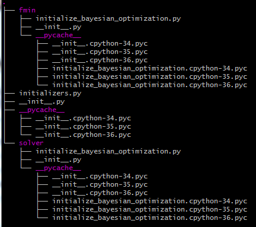

# ライブラリ"my_robo"
私は提案手法を実装するために, 既存のライブラリRoBoを継承した**"my_robo"**というライブラリを実装しました.

## ライブラリの階層構造
"my_robo"の階層構造は次のようになっています.

 この階層構造において, 重要なファイルは`solver/initialize_bayesian_optimization.py`です.

## `solver/initialize_bayesian_optimization.py`の仕様
提案手法のマルチタスク・ベイズ的最適化が実装されている中枢部になります.
関数`run()`はベイズ的最適化を実際に行うプログラムとなっており, 基本的にRoBoの実装とほぼ同じです.
変更点としては, 64行目からの

>    if self.initial_design is init_random_uniform:
>        init = self.initial_design(self.lower,
>                                   self.upper,
>                                   self.init_points,
>                                   rng=self.rng)
>
>    elif self.initial_design is "init_distance_best_result":
>        init = self.init_distance_best_result(self.lower,
>                                self.upper,
>                                self.last_incumbents,
>                                self.last_incumbent_values,
>                                self.init_points,
>                                rng=self.rng,
>                                gamma=self.gamma)

の部分です.
if文の箇所は, 初期設計をランダムに設計した場合の実装です.
一方で, elif文の箇所では,初期設計を提案手法で示した方法で実装しています.
 
提案手法にある評価関数を元にして, 関連するデータセットに対して初期設計を構成する枠組みを実装したものが,関数 **`init_distance_best_result`**にあります.
特に,

> evaluation = np.log((1.0-(inc[2]/100.0))\*\*gamma \* (c/len(best_incumbents) \* dist)\*\*(1.0-gamma

の部分が性能を直接左右する評価関数を実装した箇所です.
この評価関数は様々なものが考慮可能であり, 研究しがいのあるところだと思われます.

!!! Failure
	こちらの評価関数は**論文に掲載されているものとは異なっています.**
	修士論文などに記載されている評価関数は検証誤差の項に不備があり, 評価関数として適切であるとは言いがたいものでした.[^1]
	そのため, 現在のプログラムでは改良したものとなっています.
	残念なことに実験が間に合わなかったため, こちらのプログラムの実行は引き継ぎの方に託したいと考えています.

[^1]:具体的には,検証誤差は小さければ小さいほど良い値であるのに対し, 距離に関する値は大きければ大きいほど良い値になっていました.
これらの値の積をとってしまっていたため, 評価値