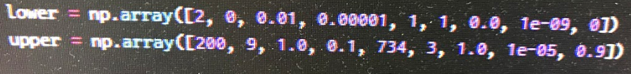

# その他の注意事項
## 修士論文における超パラメータの上限及び下限
修士論文における超パラメータの上限及び下限は次の値になっています.[^1]

## 実験の実行方法
実験を実行する際には, 基本的に以下のコマンドを入力してください.

	`bash experiment_***.sh`

## 実行可能なPrmirサーバ
私の実験環境は基本的にPrmir09, 13を想定したものになっています.
実験で必要なライブラリが不足している場合は, 最寄りのPrmir-Admin(管理者権限を有する人)に相談するようにしてください.

## スライドなどの資料
修士論文などは,一括で`nakayama/py_file/m2//article`スライドは一括で`nakayama/py_file/m2/presentation`という箇所にまとめておきます.
1つにまとめた形にしているので, 画像に重複などがある可能性がありますが, ご了承のほどお願いいたします.

## 最後に
研究は粘り強く考え, モチベーションをしっかり保ちながらできることが理想です.
私は十分にモチベーションを維持することができませんでした.
原因としては新しくアルバイトを始めるなど,自分のCapacityを超えた状態で研究に望んでしまったためです.
無論そういったことは大事ですが, モチベーションを消さない程度に研究をすすめることをおすすめします.
あと, たくさんの学友と相談や議論を重ねることをおすすめします.
研究が発展し, より良い結果が得られることを心より願っています.
 
2019年3月26日 中山峻一

[^1]:ただし, Tensorflowの仕様上,再現性が十分に取れていない点があるため必ず論文通りの結果が得られるとは限りません.