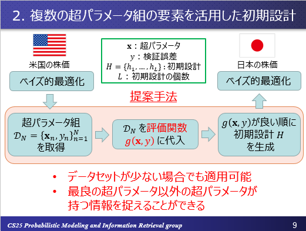

# 研究概要
## 題目
私の修士課程在籍時の研究内容は
**「マルチタスク・ベイズ的最適化を用いた複数の時系列データの分析及び予測」**
といったものです.
概要としては,複数のデータセット間の類似性に着目し, 関連するデータセットでベイズ的最適化を行った結果得られた超パラメータの情報を,転移学習のような形で最適化対象のデータセットにおけるベイズ的最適化の際に活用しています.
この題目について理解を深めるために, このページでは

* ベイズ的最適化
* Wavelet変換および2次元相関係数
* 提案手法の構成

について説明いたします.

## ベイズ的最適化
ベイズ的最適化とは, Black-Boxな（形状が不明な）関数 \(f\) が何かしらの分布（通常はガウス過程）を仮定した上で, 分布とすでに選択された点の情報を元に新たな候補点を選択します.
その後, 追加された候補点を加味して分布を更新します.
以上の処理を繰り返すことで, 最適値の候補を大域的に探索することができます.
 
ベイズ的最適化における具体的なイメージをつかむために, 最初は**関数に対するベイズ的最適化**ら理解を深めると良いと思います.
具体的には,未知の関数に対する最小値を探索する問題が取り組みやすいでしょう.
実行例の1つとして,以下の動画を示します.

<video muted src="http://127.0.0.1.:8000/video/simulation.mp4" width="640" height="360" controls></video>

左の図において, 赤色点線で示された関数が「真の」関数(未知),緑色点線で示された関数が予測した関数, 緑色の領域が信頼区間, および赤色の点は既知の観測値となっています.
また,右の図は**獲得関数(Acquisition function)**と呼ばれる, 分布と観測値の情報を元に次の候補点を選択する関数の挙動を示しています.
獲得関数の値が最も高くなった点が, 左の図の観測値として記録されていることがよく見るとわかることと思います.
探索回数を重ねることで適切に最適化を行うことに成功していることがわかります.

!!! Note
	この動画は`nakayama/py_file/m2/package/simulation.py`にあるコードから作成したものです.
	実装の際には,RoBoの代わりに を使用しています.

超パラメータ最適化問題に対しては,

* 入力値 \(x\) → 超パラメータ
* 関数 \(f\) → 機械学習モデル(LSTMなど)
* 出力値 \(y\) → 検証誤差(MAPEなど)

という図式に置き換えることで, ベイズ的最適化を適用することが可能となります.

具体的な数式などは私が過去に読んだ以下の論文が参考になるかと思います.(以降で示す論文には,私が和訳したものも一部あります. それらはすべて`nakayama/py_file/m2//article`に保管してあります.)

[Taking the Human Out of the Loop: A Review of Bayesian Optimization](https://www.cs.ox.ac.uk/people/nando.defreitas/publications/BayesOptLoop.pdf)

## Wavelet変換および2次元相関係数
Wavelet変換とは,
本研究で用いたものは連続ウェーブレット変換(Continuous Wavelet Transform)であり,次のような式で表されます.
(詳細は修士論文およびDEIM2019の最終稿を参考にしてください)

\[
W_\psi f(a,b) := \int_{\mathbb{R}^n}f(t)\bar{\psi_{a,b}(t)}dt \\
\psi_{a,b}(t) := |a|^{-n/2}\psi\left(\frac{t-b}{a}\right)
\]

本研究では, マザーウェブレット \( \psi() \) としてメキシカンハット関数を使用しています.
わかりやすい資料として,次のサイトにあるSlideShareがおすすめです.
[ウェーブレット変換の基礎と応用事例 - 連続ウェーブレット変換を中心に -](https://www.slideshare.net/ryosuketachibana12/ss-42388444)

また,**2次元相関係数**とは2種類の2次元行列の間の相関係数です.
詳細は私の修士論文を確認してほしいのですが, \(M \times N\)行列に対して実際に使用した相関係数は以下の式になります.

\[
r = \frac{\Sigma_m\Sigma_n(\mathbf{A}_{mn}-\bar{\mathbf{A}}_m)(\mathbf{B}_{mn}-\bar{\mathbf{B}}_m)}{\sqrt{[\Sigma_m\Sigma_n(\mathbf{A}_{mn}-\bar{\mathbf{A}}_m)^2][\Sigma_m\Sigma_n(\mathbf{B}_{mn}-\bar{\mathbf{B}}_m)^2]}}
\]

ここで, \(\bar{\mathbf{A}}_m = \mathbf{A}_{m1} + ... + \mathbf{A}_{mN}/N\)を示しています.

この相関係数は次の論文を参考にしたものです.
[A novel two‐dimensional correlation coefficient for assessing associations in time series data](https://rmets.onlinelibrary.wiley.com/doi/full/10.1002/joc.4998)

## 提案手法の構成
ベイズ的最適化のアルゴリズムでは,**初期設計**と呼ばれる処理があります.
先ほどの動画ですでに赤い点が選択されていたと思います.
これが初期設計によって選ばれた点群です.
ベイズ的最適化を実際に行う前に予めランダムに入力値(超パラメータ)を決定し,出力値(検証誤差)を得ておくことで,偏りのない最適化を可能としています.
 
私は,この初期設計にあてる部分をランダムに決定する代わりに, 関連するデータセットでベイズ的最適化をした結果得られた,超パラメータと検証誤差の組を活用する手法を提案しました.
提案手法の概要を次のスライドで示します.

関連するデータセットそのものをどのように選択するかについては, 先ほどの章で説明した2次元相関係数の値が高いものを活用することにより実現しています.

!!! Note
	スライドについては修士論文版などをOrganにはあげています.
	ただし, 一部変更点もありましたのでDEIM2019の発表の際に使用したスライドを`nakayama/py_file/m2/presentation`に入れておきます.
	主にこちらのスライドを参考にしてもらうのが良いかと思います.

